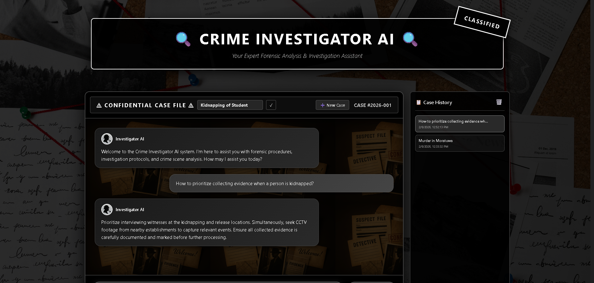

#  Crime Investigator AI

An intelligent RAG-powered chatbot designed to assist forensic investigators with crime scene procedures, investigation protocols, and evidence handling. Built with LangChain, Pinecone, and Flask.



##  System Design

**RAG Agent Architecture:**
The system uses Retrieval Augmented Generation (RAG) to provide accurate, context-aware responses. User queries trigger similarity search in Pinecone vector database, retrieving relevant document chunks from crime investigation manuals. Retrieved context is combined with the query and sent to an LLM (Gemma-3 via OpenRouter) which generates concise, professional answers based on the evidence.

**Data Sources:**
- `crime_investigate.pdf` - Core crime investigation procedures
- `Criminal_Investigation_Manual.pdf` - Comprehensive investigation manual

##  Tech Stack

**Backend:**
- Flask - Web framework
- LangChain - RAG orchestration
- Pinecone - Vector database
- OpenRouter API - LLM access (Gemma-3-12b)
- HuggingFace - Text embeddings (all-MiniLM-L6-v2)

**Frontend:**
- HTML5, CSS3, JavaScript

##  Installation & Setup

### Step 1: Clone & Setup Environment
```bash
git clone <repository-url>
cd Crime-Investigator
python -m venv venv

# Activate virtual environment
# Windows:
.\venv\Scripts\Activate.ps1
# Linux/Mac:
source venv/bin/activate
```

### Step 2: Install Dependencies
```bash
pip install -r requirements.txt
```

### Step 3: Configure Environment
Create `.env` file:
```env
PINECONE_API_KEY=your_pinecone_api_key
OPENROUTER_API_KEY=your_openrouter_api_key
GEMINI_API_KEY=your_gemini_api_key  # Optional
```

### Step 4: Index Documents
Run the Jupyter notebook to process PDFs and upload to Pinecone:
```bash
jupyter notebook research/trials.ipynb

### Step 5: Launch Application
```bash
python app.py
```
Access at: `http://localhost:5000`

##  License
Educational use only.


